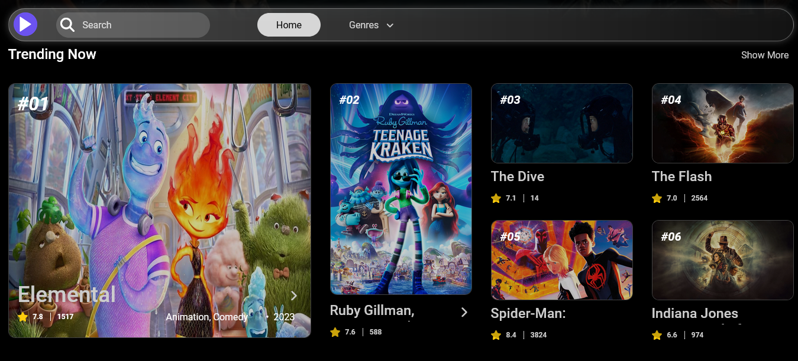

## Find movie reviews.

Hello!
Glad you are looking at my projects on github. This is one of the funnest projects I've worked on from start to finish myself. The design made using Figma. In order to create the appearance and functions, I have used vanilla CSS and JavaScript in the project. For CSS, I have used the SCCS preprocessor to be able to apply my new knowledge in the project.

As a resource, I have used the database offered by [The Movie Database](https://www.themoviedb.org/). For the XHR Request I have used the fetch method.

In the website you can see the popular movies and the highest rated movies. The films' rating, description, trailers and much more information by clicking on the icon at the top right of each film's poster image.

The page is adapted to different screen sizes. So feel free to test with different devices if you have time. You are always welcome with constructive feedback or if you have other wishes or suggestions.

Thanks.

Try on [Netlify.com](https://inspiring-marzipan-71aa51.netlify.app/)

